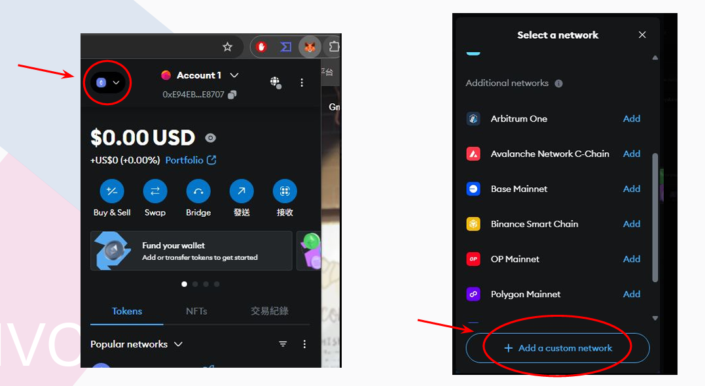
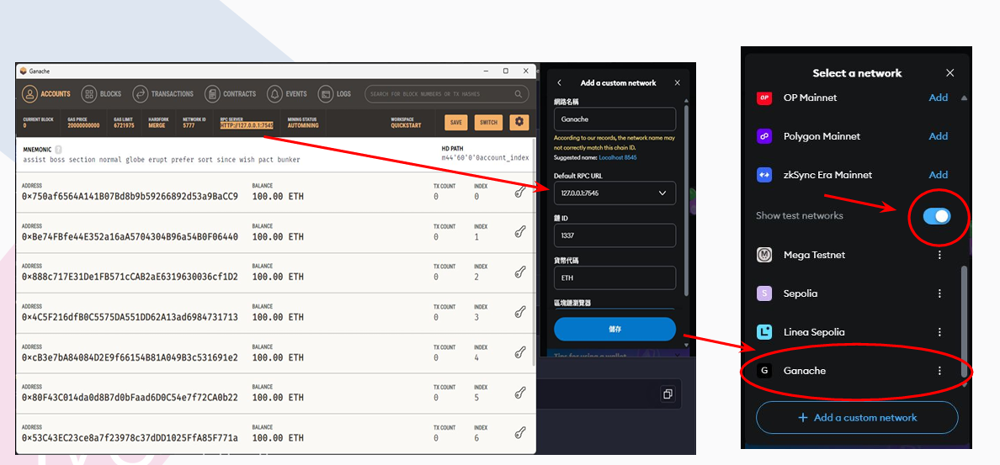
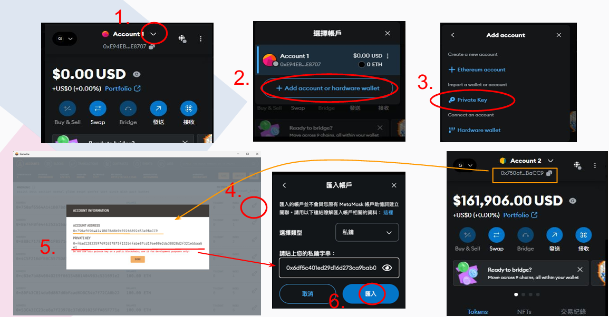
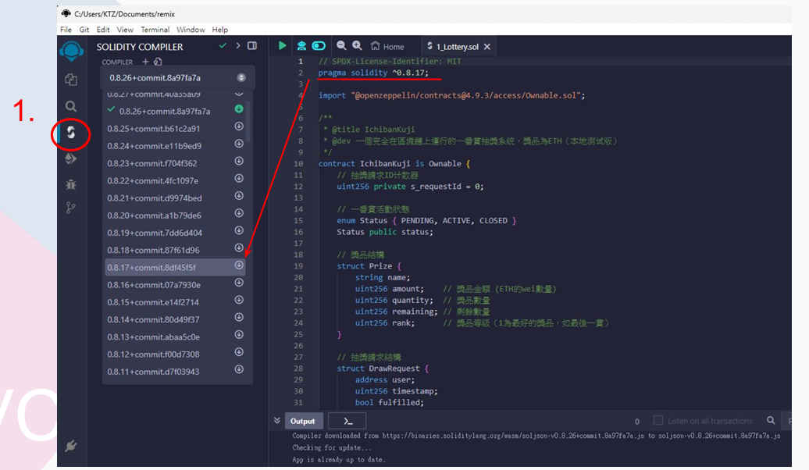
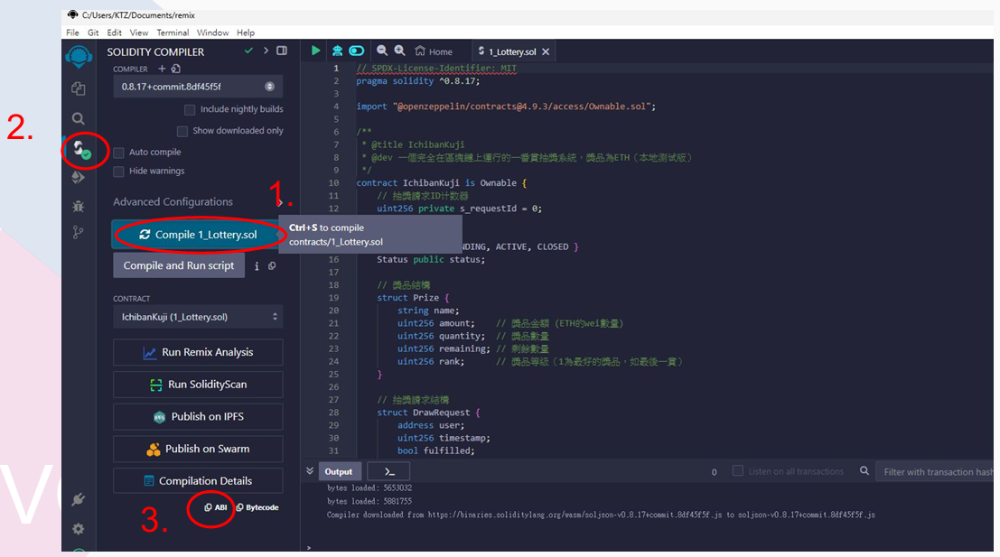
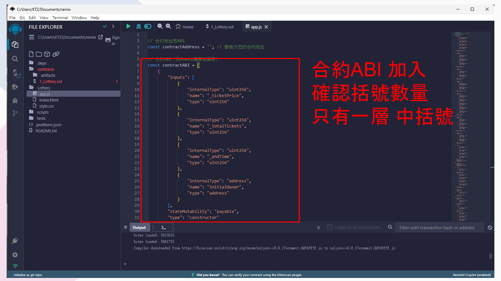
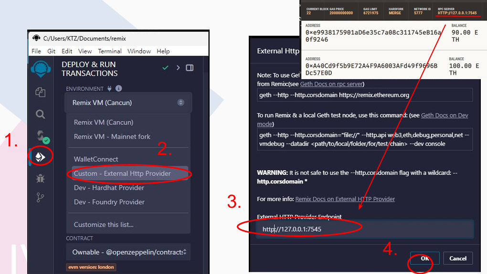
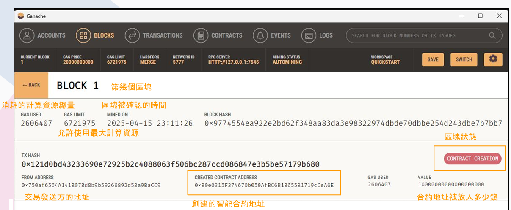
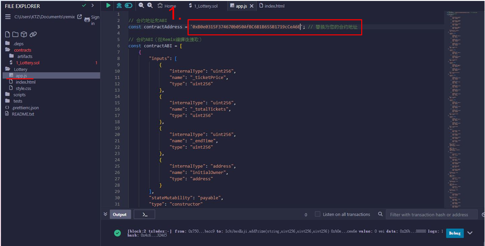

# TrainTicketSystem-MadeByChainBlock

## 前置流程:
在專案資料夾中按右鍵開啟終端並輸入 
npm init -y  
npm install express mysql2 cors  

分別
建立 package.json
安裝後端用的套件（Express 網頁伺服器、MySQL 資料庫、CORS 跨來源存取）

## MetaMask與Ganache設置:

## 使用方法:
1.先開啟xampp中的Apache及My SQL   
2.在Remix中先編譯合約 

 
3.開啟Gnache，在Remix中使用External Provider，將Gnache的網域貼上 
 

4.MetaMask 連接區塊鏈的Private Key 
5.到 Epoch Converter - Unix Timestamp Converter:https://www.epochconverter.com/ 轉換合約結束時間 
6.連接 Ganache 中區塊鏈的合約擁有者 
7:建立完成後，到app.js修改合約位址 
 
 

在終端執行: 
1.node server.js 
2.python -m http.server 
在網頁輸入:http://localhost:8000/
